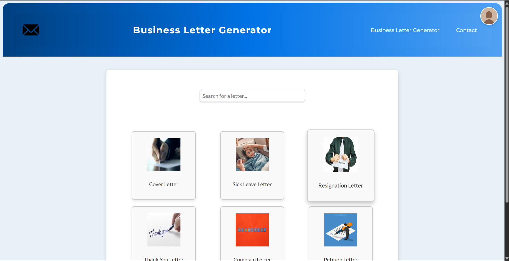

# 📝 Letter Generator

Welcome to **Letter Generator**, a simple and handy web app that helps users generate professional and personal letters with just a few clicks! 🎯

---

## ✨ Features

- 📄 Instantly generate formatted letters
- 🎯 Choose from various types: Personal, Leave, Official, Petition
- 💻 User-friendly UI – built with students and professionals in mind
- 💡 Saves time and reduces stress while writing letters

---

## 🛠️ Tech Stack

- 🌐 HTML, CSS, JavaScript
- 🎨 Canva (for UI mockups or assets, if used)
- 🤖 (Optional) AI integration planned for future versions

---

## 🚀 How to Use

1. Open the website/app
2. Select the type of letter you want
3. Fill in the required fields
4. Click **Generate**
5. Copy, download, or print your letter ✉️

---

## 📸 Demo

> 
> Example: `images/demo.png`

---

## 🔮 Future Plans

- AI-powered smart letter suggestions 🤖
- Multi-language support 🌍
- Download as PDF 📄

---

## 🙌 Contributing

Contributions are welcome! Feel free to fork the repo, open issues, or submit pull requests. 🛠️

---

## 📬 Contact

Built with ❤️ by [Jayashree](https://github.com/jayashree-br)  
For queries or feedback: **jayashree2k007@gmail.com**

---

⭐ Don’t forget to leave a star if you like it!
